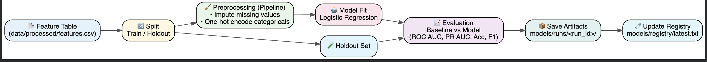

# 🚀 ML Baseline System  
### *From raw data → trusted model → reproducible predictions*

> 🎨 **Think of this repo as a well-designed machine:**  
> colorful on the outside, precise and disciplined on the inside.

---

## 🌟 Why this project exists
This repository demonstrates **how ML should be done in practice**, not just in notebooks:

🧠 **Clear problem definition**  
🧪 **Honest evaluation (baseline vs model)**  
📦 **Versioned, reproducible artifacts**  
🛡 **Prediction-time guardrails**  
📄 **Readable documentation your future self will thank you for**

If someone clones this repo and follows the README, **it just works**.  
That’s the goal. ✅

---
### Machine Learning Pipeline



---

## 🎯 What you’ll see inside
- 🧱 Proper ML **pipeline** (preprocessing + model together)
- 🔁 **Reproducibility** (dataset hash, seeds, env capture)
- 🧪 **Tests** (because ML without tests is a gamble)
- 📊 **Evaluation reports** (model card + eval summary)
- 🚦 **Decision-ready output** (ship / don’t ship)

---

## ⚡✨ Quick Start (copy → paste → smile)

> 🧩 **Requirement:** `uv` package manager  
> (fast, deterministic, modern — like this repo)

### 🟢 1. Install dependencies
```bash
uv sync
````

---

### 🟡 2. Generate sample data

```bash
uv run ml-baseline make-sample-data
```

📁 Output:

```
data/processed/features.csv
```

---

### 🔵 3. Train the model

```bash
uv run ml-baseline train --target is_high_value
```

🎉 What happens behind the scenes:

* train / holdout split
* preprocessing + model training
* baseline comparison
* artifacts saved with a unique run ID

---

### 🟣 4. Run batch prediction

```bash
uv run ml-baseline predict \
  --run latest \
  --input data/processed/features.csv \
  --output outputs/preds.csv
```

✔ schema validated
✔ model safely loaded
✔ predictions written

---

### 🔴 5. Run tests

```bash
uv run pytest
```

✅ All green = confidence unlocked

---

## 📦🎁 Artifacts (the treasure chest)

Every training run creates **immutable artifacts**:

```text
models/
├─ runs/
│  └─ <run_id>/
│     ├─ model.joblib          # trained pipeline
│     ├─ metrics.json          # evaluation results
│     ├─ input_schema.json     # prediction guardrails
│     ├─ run_meta.json         # seed, split, hash, target
│     └─ env/
│        └─ pip_freeze.txt     # exact environment
└─ registry/
   └─ latest.txt               # pointer to newest run
```

🧠 **Rule:** never overwrite runs.
📌 **Benefit:** every result is traceable.

---

## 🗂️🧭 Project Map

```text
ML_Baseline_System/
├─ src/                  🧠 ML logic + CLI
├─ tests/                🧪 safety net
├─ reports/
│  ├─ model_card.md      📄 what the model is + risks
│  └─ eval_summary.md    📊 results + decision
├─ models/
│  ├─ runs/              📦 versioned artifacts
│  └─ registry/          🧷 latest pointer
├─ data/
│  └─ processed/         📂 feature tables
├─ outputs/              📤 predictions
├─ pyproject.toml
├─ uv.lock
└─ README.md
```

---

## 📝✨ What you submit

✅ working code (`src/`)
✅ passing tests (`tests/`)
✅ filled `reports/model_card.md`
✅ filled `reports/eval_summary.md`

> 🎓 **Grading checkpoint:**
> A teammate can clone this repo, follow this README,
> and successfully **train + predict** without confusion.

---

## 📊🧠 Model snapshot

* **Model:** Logistic Regression
* **Preprocessing:** imputation + one-hot encoding (`Pipeline`)
* **Evaluation:** baseline vs model on holdout
* **Decision:** documented and justified (not just accuracy)

---

## ⚠️🚦 A note on honesty

Perfect metrics ≠ perfect model.

This project intentionally shows:

* 🚨 how leakage can fool metrics
* 🧱 why baselines matter
* 📄 why documentation matters more than hype

That’s **real ML engineering**.

---

## 🛠️🧑‍🔬 Troubleshooting

🟥 **Command not found?**

```bash
uv sync
```

🟨 **Import errors?**
Make sure you’re in the repo root (same folder as `pyproject.toml`).

🟦 **Suspicious results?**
Check:

* dataset hash
* run metadata
* evaluation reports

---

## ✨ Final words

This repo is designed to be:

🎨 **Beautiful to read**
⚙️ **Reliable to run**
🧪 **Safe to evaluate**
🎓 **Easy to grade**

If it feels calm, colorful, and intentional —
that’s exactly how good ML systems should feel. 🌟

